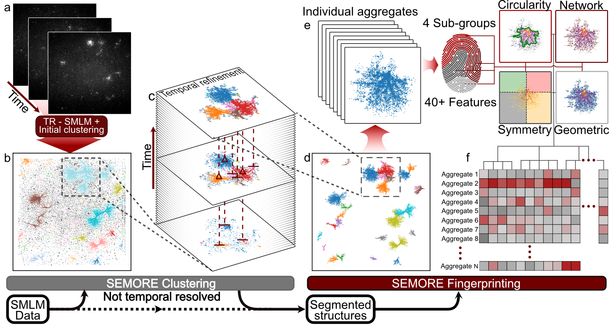

# SEMORE
## SEmi-automatic MOrphological fingerprinting and segmentation Extraction
A multi-independent-module pipeline for structure segmentation and disection in single molecule localization microscopy (SMLM) data and the extraction of unique morphological fingerprints.

### Citing
TBA
### Dependencies
  - python==3.8
  - pandas==1.5.3
  - matplotlib==3.7.1
  - scipy==1.10.1
  - hdbscan==0.8.29
  - opencv==4.6.0
  - scikit-learn==1.2.2
  - umap-learn==0.5.3
### Usage
#### Installation
SEMORE is most easily setup in a new conda environment with dependecies and channels found in dependency.yml - Running the bash commands below, which creates the environemnt, downloades and installs packages, takes 9m 35s 
```bash
git clone https://github.com/hatzakislab/SEMORE
cd SEMORE
conda env create -f dependency.yml
conda activate SEMORE
```
SEMORE modules and additional/helpful functions are contained in the `Scripts` folder.
SEMORE modules are imported as:
```python
from Scripts.SEMORE_clustering import find_clust
from Scripts.SEMORE_fingerprint import Morphology_fingerprint
```
Three test python scripts are provided:
  - `Data_sim_test.py` - test data generation.
  - `Segmentation_test.py` - test the clustering module on simulated data.
  - `Fingerprint_test.py` - test the fingerprint modules on the resulting data from Segmentation_test.py.
### Own data
`SEMORE_clustering.find_clust` accepts 2-D localizations containing a temporal element [x,y,t] while `SEMORE_fingerprint.Morphology_fingerprint` accepts localizations [x,y] both static and temporal resolved. The output of the fingerprintg can then freely be used for further analysis.

### For demostration
For demostration regarding presented data contained in the manuscript, please refer to the `_For_puplicaiton` folder where you will find the required information and scripts.

### Contact
https://www.hatzakislab.com/


Nikos S.Hatzakis, Professor\
Department of Chemistry\
hatzkais@chem.ku.dk

Jacob Kæstel-hansen, PhD fellow\
Department of Chemistry\
jkh@chem.ku.dk

Steen W. B. Bender, Master student\
Department of Chemistry\
csq439@alumni.ku.dk

